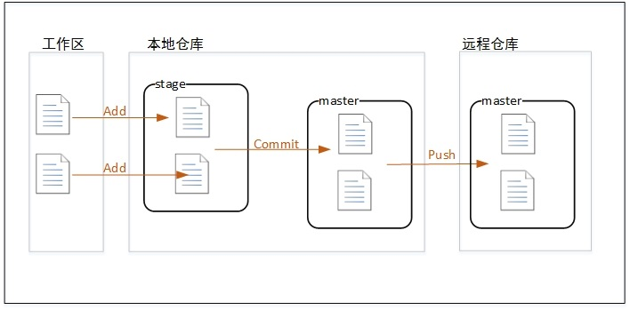

<!-- more -->

## 1. 获取本机不存在的Project

**未建立项目时**

```
Checkout from Version Control > Git
```


在编辑器内时

```
VCS > Checkout from Version Control > Git

//或者//

Git > Clone
```


URL 服务器端存储地址

```
ssh://git@ip:port/home/git/*.git
```


### 对于JSP<Java Web>项目配置环境

配置SDK

```
File > Project Structure
​     \> Project     配置SDK
​     \> Modules   配置jar包     
​         \+ > Library > Application Server Libraries > Tomecat
```


配置支持框架

```
右键项目 > Add Framework Support >
​    勾选Web Application
```


配置服务器

```
Edit Configurations > + > Tomcat Server > Local
```


## 2. 将新建本地Project保存到远程仓库

### 新建远程仓库

登陆服务器Git用户

```
cd      //切换到~home    
git init --bare *.git
```


### IDEA中 创建本地仓库

```
VCS > Import into Version Control > Create Git Repository

选择当前Project目录

右键工程 > Git > Add
```


### 将本地仓库推到远程仓库

```
Comit 添加注释后

Push > Define Remote > URL
​    ssh://git@ip:port/home/git/*.git
```


## 3. 将本地Project更改Push远程仓库

提交[Commit-(Ctrl+K)-]更改到本地仓库  并添加备注

将本地仓库Push-(Ctrl+Shift+K)-到远程仓库  选择需要提交的更改[注释显示]


## 4. 更新本地Project

**Pull**

Pull是直接下载并合并

**Fetch**

Fetch是从远程仓库下载文件到本地的origin/master，然后可以手动对比修改决定是否合并到本地的master库


## 5. 新建和提交分支

**创建本地分支**

```
VCS > Git > Branches
或者 右下角Git:Master
​    \> +New Branch
```

在分支下Push, 提交分支


## 6.获取和合并分支

切换本地分支

```
Git:master > Local Branches > A Branche > CheckOut
```


获取远程仓库新分支

```
Pull > 刷新按钮 > Pull

Git:master > Remote Branches > A Branche > Checkout As
```


合并分支到主分支

```
VCS > Git > Repository > Merge Changes

勾选需要合并的分支 > Merge
```


## 同步原理注释


